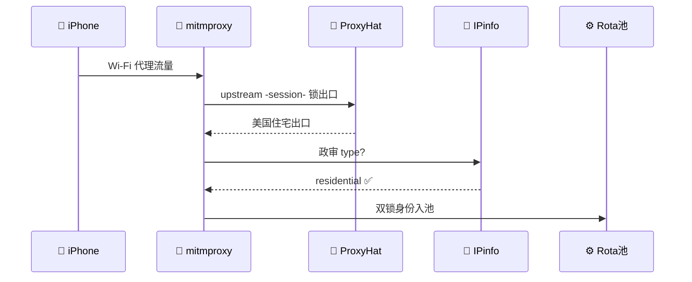

# 📘 iOS 流量情报 · 架构指南


> "README is the FACE. Put makeup in a decent way." — Gaganpreet Kaur Kalsi

**目录**：[选型](#一回-选型定座次)｜[组件](#二回-组件谱系)｜[存储](#三回-池府-redis-心法)｜[验证](#四回-判官双璧与精度靶)｜[链路](#全局链路流转)

---

## 一回 · 选型定座次

| 席位 | 选型 | 理由 |
|------|------|------|
| 池底座 | ✅ 崔庆才 ProxyPool | Redis+API 同架构，中文保姆文档 |
| 出口 | ProxyHat | `-session-xxx` 绑美国住宅出口 |
| 渲染 | mitmproxy2swagger | `.mitm` → API 地图 |
| 执行 | bogdanfinn/tls-client | `safari_17.0_ios` 变声器 |
| 储备 | utls | 遇查 JA3 之敌方才出山 |
| 秒查 | GeoLite2 MMDB 本地 | 不劳 ip.sb |
| 验血统 | IPinfo Privacy API | `type=residential` 方发放行牌 |
| 可视化 | Grafana | Rota 池健康分 + 状态看板 |

---

## 二回 · 组件谱系


| 组件 | 定位 | 一行事实 | 启用条件 |
|------|------|----------|----------|
| utls | TLS 握手定制 · 根原型 | 可逐字段 mimick iOS Safari ClientHello | 储备，目标查 JA3 时才启用 |
| tls-client | 指纹伪装执行层 | `client_identifier` 含 `safari_17.0_ios` 等 | 多身份生成 |
| 崔庆才 ProxyPool | 池底座 | settings/db/schedule/api 四件套架构 | Redis+API 基础 |
| GeoLite2 | 归属秒查 | 国家级精度 99.8% | 本地 MMDB，只信外环 |
| IPinfo | 血统验证 | `type` 三值：residential/datacenter/cellular | 入池放行仅认 residential |
| ProxyHat | 出口供应商 | `-session-xxx` 绑定美国住宅出口 | 双锁之出口侧 |

> 旁支参照：curl_cffi（C 系同类实现）、jhao104（同架构先行者）、Scamalytics（打分逻辑参考）。

---

## 三回 · 池府 Redis 心法

**��功**：`redis-server`（Windows 走 WSL）→ 验活：`redis-cli ping` 回 `PONG`

```text
ZCARD  proxies:universal                  # 池里几条命
ZRANGE proxies:universal 0 9 WITHSCORES  # 前十强+健康分
ZADD   proxies:universal 10 1.2.3.4:8080 # 手动喂池
ZREM   proxies:universal 1.2.3.4:8080    # 逐出池
```

**口诀**：池乃有序集合，score 即健康分，高分者好学生。

---

## 四回 · 判官双璧与精度靶

| 判官 | 看什么 | 硬伤 | 杀手锏 | 本府用法 |
|------|--------|------|--------|----------|
| GeoLite2 | 路由表+WHOIS | 看不穿住宅/机房 | 国家 99.8%+本地 MMDB | 秒查，只信外环 |
| IPinfo | 探针+众包 | 付费限流 | type 三值 | 入池政审 |
| Scamalytics | 欺诈模型 | 商业 | Fraud Score | 打分参考 |


> 🎯 **靶规**：外环绿=国家 99.8% ／ 中环橙=州 ~85% ／ 内环红=城市 ~70%。**只信外环，不赌内环**。

---

## 全局链路流转



[⬆ 回卷首](#-ios-流量情报--架构指南)